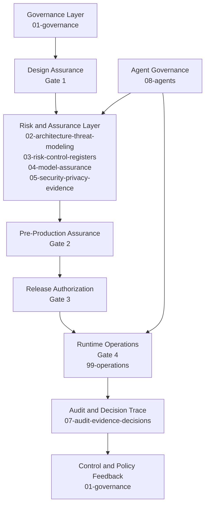

# Enterprise AI TRiSM Governance-as-Code Repository

## Disclaimer
This is an independent, AI-generated, experimental open-source repository.

It is not affiliated with, endorsed by, or sponsored by Gartner.
It does not provide certification, legal advice, or compliance guarantees.

## Experimental Purpose
This repository exists for experimentation, learning, and practical exploration of AI governance concepts using governance-as-code patterns.

The artifacts are templates and examples that must be tailored by each organization to its own risk profile, legal context, and operating model.

## TRiSM Reference Model
This repository uses Gartner AI TRiSM as a conceptual operating model for trust, risk, security, and runtime enforcement in AI systems.

TRiSM is treated here as a practical operating model implemented through engineering controls, lifecycle gates, and operational evidence. It is not used as a checklist or certification claim.

## Repository Mission
Move AI governance from static policy documents into operational practice through versioned artifacts, reviewable evidence, and enforceable workflows.

## Intended Audience
- AI platform engineering teams
- AI and model risk teams
- Security engineering and security operations teams
- Privacy and data governance teams
- Internal audit and assurance teams
- Data and AI leadership stakeholders

## Lifecycle Scope
This repository covers the following lifecycle phases:
- Design
- Deployment
- Runtime operations
- Audit and review

## Repository Structure
- `01-governance` - charter, control mappings, impact assessments, and oversight plans
- `02-architecture-threat-modeling` - architecture context and AI-specific threat modeling
- `03-risk-control-registers` - risk register and treatment governance
- `04-model-assurance` - model and system assurance templates and guidance
- `05-security-privacy-evidence` - security, privacy, and runtime monitoring evidence
- `06-deployment-gates` - canonical Gate 1 through Gate 4 definitions and checklists
- `07-audit-evidence-decisions` - decisions, exceptions, and review records
- `08-agents` - agent specifications and agent governance controls
- `99-operations` - incident response, feedback loop, and accountability operations

## TRiSM Architecture View

## Governance-as-Code Flow
Pull requests and protected branch workflows are used as enforceable governance controls:
1. Create or update governance artifacts in a pull request.
2. Attach required evidence for target gate and impacted controls.
3. Route reviews to required owners and code owners.
4. Merge only after required approvals and validation checks pass.
5. Preserve artifacts as an auditable decision trail.

## Governance Cadence
| Cadence | Activity | Primary Outputs | Owners |
|---|---|---|---|
| Per release | Gate readiness and approval review | Gate checklist, decision record, evidence links | Governance Lead, Platform Lead, domain approvers |
| Monthly | Risk and runtime monitoring review | Risk status updates, KPI and KRI updates | Risk owners, Platform Lead |
| Quarterly | Control and policy review | Control matrix refresh, exception review | Governance Lead, Security, Privacy, Audit |
| Ad-hoc | Incident-driven governance updates | Incident review, control updates, approvals | Incident Commander, Governance Lead |

## Framework Alignment
This repository is designed for practical alignment and mapping across multiple frameworks, including:
- Gartner AI TRiSM (conceptual operating model reference)
- NIST AI RMF
- ISO/IEC 42001
- EU AI Act (where applicable)

Framework alignment in this repository is informational and operational. It should not be interpreted as formal compliance or certification.

## How To Use
1. Copy templates and populate them for your deployment context.
2. Open a pull request using `.github/PULL_REQUEST_TEMPLATE/trism-gate.md`.
3. Complete `.github/trism-governance-checklist.md`.
4. Obtain required gate and domain approvals before merge.
5. Track decisions and exceptions with time-bound review criteria.

## Optional Repository Assets
- `examples/Risk-Register-Example.md` - fictional risk register example
- `examples/Model-Card-Example.md` - fictional model card example
- `examples/Deployment-Gate-Approval-Example.md` - fictional gate approval example
- `README_EXEC.md` - executive summary variant for leadership stakeholders
